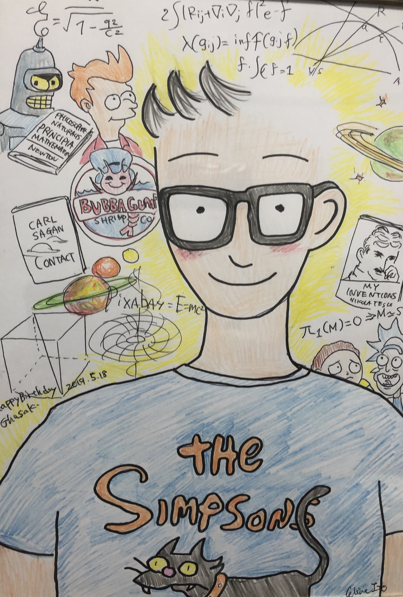

### Hi there 👋

 

<!--
**Ghasak/Ghasak** is a ✨ _special_ ✨ repository because its `README.md` (this file) appears on your GitHub profile.

Here are some ideas to get you started:

- 🔭 I’m currently working on ...
- 🌱 I’m currently learning ...
- 👯 I’m looking to collaborate on ...
- 🤔 I’m looking for help with ...
- 💬 Ask me about ...
- 📫 How to reach me: ...
- 😄 Pronouns: ...
- ⚡ Fun fact: ...
-->

## Basics Stats

<!--  -->
<!-- -->

<!---->
<!---->

<!-- 
 -->
<!-- <a href="https://github.com/anuraghazra/github-readme-stats"> -->
<!--    -->
<!-- </a> -->
<!-- <a href="https://github.com/anuraghazra/convoychat"> -->
<!--    -->
<!-- </a> -->
<!-- 
 -->
<!--  -->

<!-- 
 -->
<!-- <a href="https://github.com/anuraghazra/github-readme-stats" style="margin-right: 20px;"> -->
<!--   <!-- -->
<!-- </a> -->
<!-- <a href="https://github.com/anuraghazra/convoychat"> -->
<!--    -->
<!-- </a> -->
<!-- 
 -->

### Activity Graph
<!--  -->
<!--  -->
<!--  -->
<!--  -->
<!--  -->
<!---->

<!-- transparent theme examples -->

## 🃏 Here is a random joke!

<!-- HTML -->

## Links

<!--  -->

<!-- Reference
https://github.com/anuraghazra/github-readme-stats
https://github.com/alexandresanlim/Badges4-README.md-Profile?tab=readme-ov-file#-activity-graph-
https://github.com/ryo-ma/github-profile-trophy?tab=readme-ov-file#apply-theme
https://github.com/ryo-ma/github-profile-trophy?tab=readme-ov-file
https://github.com/anuraghazra/github-readme-stats
https://github-profile-summary-cards.vercel.app/demo.html
https://github.com/ABSphreak/readme-jokes
https://github.com/anuraghazra/github-readme-stats
https://codemaker2016.medium.com/tips-and-tricks-to-create-an-awesome-github-profile-readme-ce3825a355c7
https://shields.io/badges
https://www.youtube.com/watch?v=a8CwpGARAsQ&t=110s
https://docs.github.com/en/account-and-profile/setting-up-and-managing-your-github-profile/customizing-your-profile/managing-your-profile-readme
- [Markdown Badges](https://ileriayo.github.io/markdown-badges/)
###################################################
Daily Usage
##################################################
https://ileriayo.github.io/markdown-badges/
https://shields.io/badges/static-badge

-->
